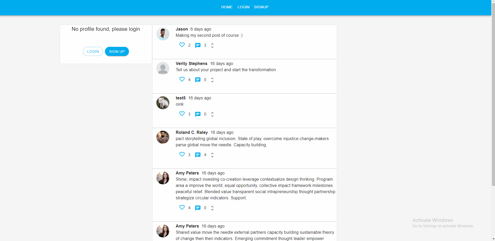
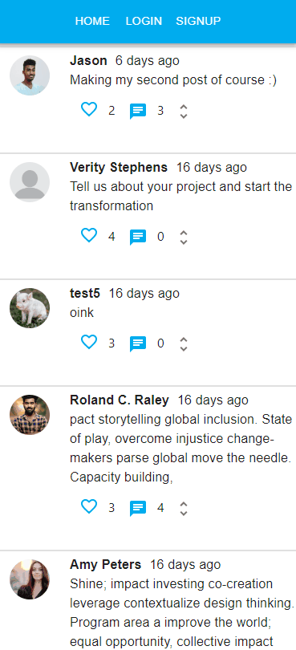
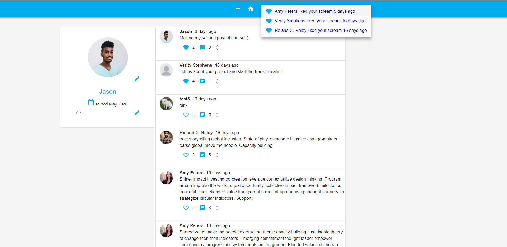

# REACT + FIREBASE: Mock Social Platform

## Welcome! 👋

Thank you for checking out this coding project, click here to see a [LIVE DEMO](https://socialchimp-5c8f3.web.app/)

This repository is the frontend portion, to see the work that was put into the backend of this project please check out this [REPO](https://github.com/ramos-codes/Mock-Social-Backend)

## The Objective

As part of an attempt to challenge and test my skills with React/Redux, backend development and CSS styling, I found this project through an online course provided by [Ahmed Hadjou](https://github.com/hidjou).

The goal of this project is to set up a database (firestore) using google’s platform: firebase, to serve as our backend for a Mock Social Media web app. Then to connect to that REST api using React and Redux to code the logic and UI for the frontend portion of the application.

Users should be able to:

- Login/SignUp with a validated form
- Create/Read/Update/Delete “posts” on the platform
- Edit details on their profile, including their profile picture
- Have proper authentication and security to block unauthorized access to a user’s profile/posts
- Have a responsive experience both on desktop and mobile
- Like/Comment on other user’s posts
- Receive unread notifications and mark those notifications as read
- Share a post link and reference that link to be directed to that post only

## What I Learned

As mentioned before the source code for the backend can be found [here](https://github.com/ramos-codes/Mock-Social-Backend)

Some of the tools and technologies I got my hands on with this project I have never touched before, others I have. The following tools were used to build out the frontend of this project:

- Material UI => to handle the responsiveness and styling of all components across the site
- React => the best javascript library in the world
- Redux => to manage state and dispatch calls to the firebase API

I was faced with a few challenges throughout the build. However, those challenges have helped me grow and develop a stronger skill set for web development

Obstacles that I overcame:

- Making the layout responsive
- Using a REST API from Firebase
- Making those API calls with Redux
- Managing state with Redux
- Working with a component library such as Material-UI
- Handling form validation and displaying errors on the form itself

Most importantly this project has given me more hours to work with React code and solving/debugging common issues that come with Web Development.

